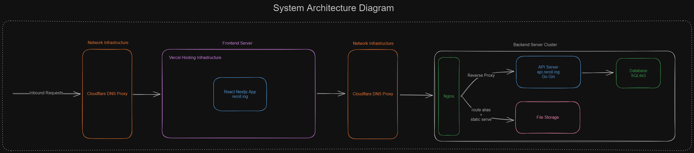
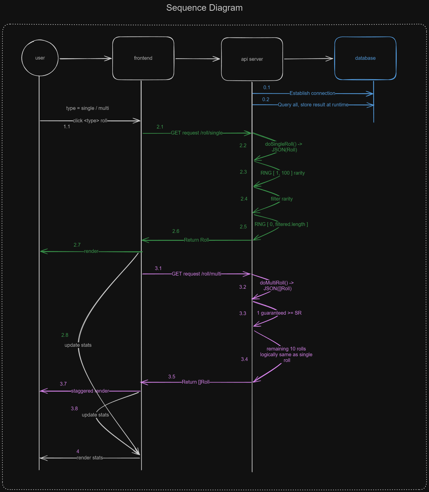
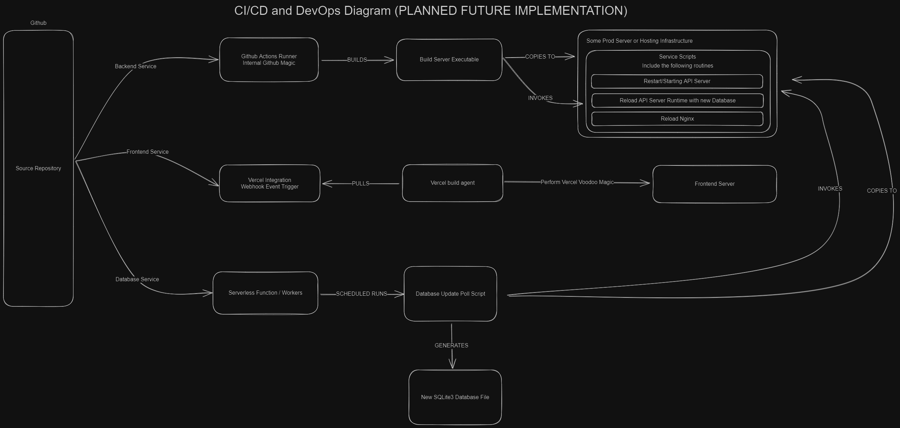

# [Reroll.ing](https://reroll.ing)

The wise words of ThePrimeagen:

> I have this dumb idea in my head and I will make this thing ~[work]~.

So... I built this full-stack FGO gacha simulator in, what is to me, a record time of 5 days (to reach MVP status).

Since then, I have iterated over the application like mad to dish out features.

## N.B.

I do not own the characters, names, and attributes that might appear during the usage of this software. Those are the intellectual properties of their respective copyright holders.

I, however, hold copyright for the source code and my trade names.

I'm not affiliated with any entities mentioned or whose resource I use in this project, e.g. FGO and its owner, Atlas Academy, and others, but myself. Nor do I claim to be partnered with, sponsored or funded by the aforementioned.

## Features and TODOs


- [x] Func: Single roll
- [x] Func: Multi roll

<hr/>

- [x] FE: Servants card face
- [ ] FE: Servants class indicators
  - [x] Text only
  - [ ] Symbol
- [x] FE: Servants rarity indicators
  - [x] Text only
  - [x] Symbol
- [x] FE: Staggered render 
- [x] FE: Servant information page (dynamic routing)

<hr/>

- [ ] DB: Scheduled data update task
- [x] DB: Servant images
  - [x] Image retrieval
  - [x] Store to image database
  - [ ] Caching

<hr/>
     
- [ ] SV: API rate limiting

<hr/>

- [ ] DevOps: Automated deployment
  - [x] Dockerfile for server
  - [x] Github Actions for server + database
  - [ ] Deploy to production server
- [ ] DevOps: Reset/Improve versioning
  - [x] Follow semver
  - [ ] Automate tag generation
  - [ ] Automate version increment
  - [ ] Separate versioning for each component
     
## Frontend/UI

Just a simple Nextjs application bootstrapped via `create-t3-app`.

## Database

Everything in this domain is done in Python.

### CLI options

These are executed via `python main.py <option>`

- No options, default: Initialize the SQL database and add to it the data from `.json` manifest.
- `full-update`: (Housekeeping) Update the `.json` manifest, fetch and store image assets **from the Atlas Academy API**.
- `download-faces`: (CI/CD) Download the latest image assets from Github release.
- `zip`: (Housekeeping) Zip the downloaded asset folder into a zip file for release publishing.

### How it works

Servants data is retrieved from [Atlas Academy](https://atlasacademy.io) API. The dataset type is basic with servant names in both EN and JP and includes the servant card face asset URL.

The database contains a reduction of this dataset which only includes the following properties/columns/attributes:

```sql
CREATE TABLE servants(
  collectionNo INT PRIMARY KEY,
  sv_name VARCHAR(128) NOT NULL,
  rarity INT,
  class_name VARCHAR(50) NOT NULL,
  face VARCHAR(200) NOT NULL
);
```

Currently, it is implemented in the simplest database SQLite3 for local development with plans to eventually host on a PostgreSQL server somewhere.

### Update

The database update strategy is polling. Every 2 weeks, a schedule task SHOULD run to fetch the latest dataset from the Atlas Academy API. After fetching, the task SHOULD simply execute an update function which would insert any new entries into the database, which SHOULD handle the PRIMARY KEY collision exception and skip existing servant entries.

NOTE: I acknowledge that this is not the most efficient nor optimized way; however, it is not a resource intensive operation nor a frequent operation, so this is a good enough trade-off with the efforts needed to develop better code.

For example:

```python
def fetch_new_data():
    url = "https://api.atlasacademy.io/export/JP/basic_servant_lang_en.json"
    r = requests.get(url)
    data = r.json()

    return data

def update_db(json_data):
    """
    Update the SQLite database with the data from the json file
    """

    current_path = os.getcwd()
    for i in range(len(json_data)):
        try:
            face_path = f"https://api.reroll.ing/assets/{json_data[i]['collectionNo']}.png"
            cur.execute("INSERT INTO servants (collectionNo, sv_original_name, sv_name, rarity, class_name, atk_max, hp_max, attribute, face_url, face_path) VALUES (?, ?, ?, ?, ?, ?, ?, ?, ?, ?)",
                        (json_data[i]['collectionNo'], json_data[i]['originalName'], json_data[i]['name'], json_data[i]['rarity'], json_data[i]['className'], json_data[i]['atkMax'], json_data[i]['hpMax'], json_data[i]['attribute'], json_data[i]['face'], face_path))
        except sqlite3.IntegrityError:
            print(
                f"Servant already exists in database, skipping: {json_data[i]['collectionNo']} - \"{json_data[i]['name']}\"")

        con.commit()
```

## API Server

Everything here is written in Golang.

I use Gin as the server which will handle the API routing.

There are simply 2 routes for 2 roll scenarios:

- `/roll/single`
- `/roll/multi`

### Initialization

On pre-connection, we read and set the environment variables from `.env`.

On setup, the server will initialize a connection with the SQLite database. This is simply a static file read which looks for a `sv_db.db` generated from the Python package above.

After the SQL database "connection" is established, we do a `SELECT * FROM servants` 🤡 and store the query results in a runtime variable, a `[]Servant` slice. Then, we simply mutate and access the retrieved dataset as needed by each roll scenario.

The server uses default CORS config defined in the `cors` package and listens on `localhost:8080`.

### Roll Logic

#### Single roll

Takes the servants slice from as its parameter.

Roll an integer from 1 to 100

- Roll a `[1,1]`
  1. Filter SSR from the servants slice (by matching rarity) -> `filtered []Servant` slice
  2. Roll a number [0, len(filtered)] -> `local_roll`
  3. Append `filtered[local_roll]` to the response body
- Roll a `[2,4]`
  - Same idea
- Roll a `[5, 100]`
  - Same idea

#### Multi roll

I expected the implementation for multi roll would be difficult, but it turned out to be more cumbersome than hard.

First, I create a `guaranteed []Servant` slice as the pool containing only SSR and SR servants.

For multi roll, 1 out of the 11 rolls is a guaranteed rarity 4 or above servant.

To handle this case, I simply put it in a loop and add a condition for the first iteration.

Then, I proceeded with the rest of the cases similarly to the single roll.

Now looking back, I also put the 3\* and below servants in their own slice as well, but I don't really need it for the implementation. BUT then I'm too lazy to remove it so... whatever. Probably speed it up by 0.01% (I pulled that number out of thin air, don't quote me on that).

### Other query routes

- GET all servants `/servants`
- GET servant by collection number `/servants/:collectionNo`
- GET API server status `/health`
- GET total number of servants `/stats/total_servants`

## Deployment

- Frontend -> Vercel
- Database + Server -> baremetal Linux VPS

To deploy, the following steps I took were:

Get the API server running and listening on `localhost:8080`

1. Create a VPS for `$5` a month
2. `ssh` into it
3. Install `go`, `build-essential`, `tmux`, and `git`
4. Clone the repo
5. Add the environment variables
6. Build the executable binary with `go build`
7. Start `tmux`
8. Run the server `./server`

Networking

1. Add the server's static IP to DNS A record on Cloudflare
2. Install `nginx`, `certbot`, `python3-certbot-nginx`
3. Configure `nginx`'s site configuration

   ```nginx
    server {
      server_name _;  // catch all

      location / {
        proxy_pass http://localhost:8080
      }
    }
   ```

4. Start `nginx` service: `systemctl enable --now nginx`
5. Obtain SSL cert: `certbot --nginx -d api.example.com`

> If you're lucky, it'll work on the first try 🥲

## Pretty Diagrams

### System Architecture



### Sequence



### CI/CD & DevOps


